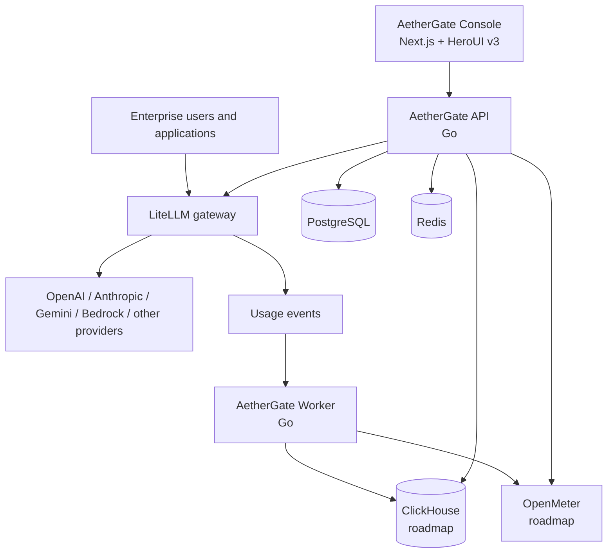

# AetherGate

**Open-source enterprise AI gateway and usage intelligence platform.**

[简体中文](./README.zh-CN.md) · [Architecture](./docs/architecture/system-overview.md) · [Deployment](./docs/deployment/server-foundation.md) · [Helicone parity](./docs/product/helicone-feature-parity.md) · [Roadmap](./docs/roadmap/README.md)

> Project status: active foundation development. The Console and initial Go API run locally, but their current observability data is explicitly development seed data. Public APIs, schemas, and deployment topology may change before the first stable release.

AetherGate is an enterprise control plane for routing, metering, governing, and analyzing LLM API traffic across providers, organizations, teams, projects, applications, and engineers. It is initiated and maintained by TopoAI as an independent Apache-2.0 project.

## What works today

- A Next.js 16, React 19, Tailwind CSS v4, and HeroUI v3 dark Console.
- Working Dashboard, Requests, Organizations, API Keys, Workspaces, Projects, Members, Models, Providers and Provider Health, Routing, Rate limits, Budgets, Alerts, Webhooks, Scheduled Reports, Notifications, Enterprise Vault, Audit Trail, and Developer Integration Diagnostics product surfaces.
- A registered product route for every capability in the Helicone migration baseline; unfinished routes show their real delivery state instead of pretending to be complete.
- A Go control-plane API with health, observability, organization, API-key, workspace, project, member, model, provider-health, routing, rate-limit, budget, alert, webhook, scheduled-report, notification, envelope-encrypted Vault, immutable audit-event, chain-verification, retention-policy, audit-export, and credential-safe LiteLLM diagnostics endpoints.
- In-memory development storage plus an optional pgx/PostgreSQL repository and explicit reversible migrations.
- Provider health combines queued active probes, passive telemetry, three-failure debounce, maintenance suppression, transition evidence, and explicit routing eligibility.
- Automated Go endpoint tests, TypeScript checking, ESLint, and a passing production Console build.
- A runnable LiteLLM, PostgreSQL, PgBouncer, and Redis development stack under `deploy/compose/core`.
- A complete [Helicone-to-AetherGate feature matrix](./docs/product/helicone-feature-parity.md) with auditable acceptance boundaries.

The implemented Console surfaces call the Go API and fall back to clearly labelled local preview data when it is unavailable. Observability remains development seed data, and PostgreSQL persistence has not been exercised on this workstation. LiteLLM configuration and liveness/readiness diagnostics are implemented without exposing the master key or reading LiteLLM tables, but real streaming traffic, virtual-key enforcement, routing, and usage attribution have not been exercised against a live stack. Active provider checks, report generation, external notification delivery, audit-export object generation, and privileged retention expiry require isolated workers. Vault metadata, AES-256-GCM envelope encryption, version rotation, disable semantics, internal-only resolution, and access evidence are implemented, but external KMS/key-ring rewrapping and live provider/worker resolution are not. Audit append/search/hash verification and policy/export control-plane behavior are implemented, but automatic audit emission from every administrative domain is not. Tenant authentication, enforced HTTP authorization, live worker execution, and live database integration remain foundation work and are not marked complete.

## Why AetherGate

Most API relay systems center on individual accounts, balances, and basic usage totals. AetherGate is designed around enterprise operations:

- organizations, workspaces, departments, projects, applications, and members;
- API keys, model access policies, RPM/TPM limits, concurrency, budgets, and routing policy;
- request, token, cost, latency, reliability, quality, and engineering-adoption analytics;
- prompt management, datasets, playgrounds, evaluations, and experiments;
- auditable administration and integration with enterprise identity and billing workflows;
- self-hosted deployment with a clear path from one server to distributed services.

## Architecture



LiteLLM is the model data plane: routing, provider connections, virtual keys, limits, and failover. AetherGate is the enterprise control plane: tenancy, authorization, governance, observability, reporting, and product workflows. See the [system overview](./docs/architecture/system-overview.md) for service and data ownership.

## Quick start

Prerequisites:

- Node.js 20 or newer and npm 11 or newer
- Go 1.26.4 or newer
- Docker with Compose v2 for the infrastructure stack

Install and start the Console:

```powershell
npm install
npm run dev
```

The Console is available at `http://localhost:3000`.

Start the Go API in a second terminal:

```powershell
go run ./apps/api/cmd/server
```

The API listens at `http://localhost:8080`. Its initial endpoints are:

- `GET /healthz`
- `GET /readyz`
- `GET /api/v1/overview`
- `GET /api/v1/requests`
- `GET /api/v1/requests/{requestID}`

Run the current verification suite:

```powershell
npm run typecheck
npm run lint
npm run build
go test ./apps/api/...
go vet ./apps/api/...
```

## Infrastructure stack

The reviewed source for the existing `aethergate-litellm-stack` belongs in [`deploy/compose/core`](./deploy/compose/core/README.md). Keep the server deployment under `/opt/aethergate` or `/opt/aethergate-litellm-stack`; do not copy runtime secrets or database data into Git.

1. Copy only the version-controlled stack source into `deploy/compose/core`.
2. Do **not** commit `.env`, generated secrets, backups, logs, or database volumes.
3. Follow [Importing the existing stack](./docs/deployment/stack-import.md).
4. Follow [Server foundation deployment](./docs/deployment/server-foundation.md) to configure, start, verify, back up, restore, and update the services.

## Repository layout

```text
aethergate/
|-- apps/
|   |-- console/                 # Next.js, TypeScript, HeroUI v3
|   |-- api/                     # Go control-plane API
|   `-- worker/                  # Go event and background workers
|-- packages/
|   |-- ui/                      # Shared UI and DataGrid boundary
|   |-- contracts/               # OpenAPI and cross-service schemas
|   |-- database/                # Database conventions and migrations
|   |-- sdk/                     # Generated or maintained client SDKs
|   `-- config/                  # Shared repository configuration
|-- integrations/
|   |-- litellm/
|   |-- openmeter/
|   `-- clickhouse/
|-- deploy/
|   |-- compose/core/            # LiteLLM development stack
|   |-- compose/analytics/       # ClickHouse/OpenMeter deployment, later phase
|   |-- postgres/init/
|   |-- pgbouncer/
|   |-- litellm/
|   `-- monitoring/
|-- docs/
|   |-- product/
|   |-- architecture/
|   |-- development/
|   |-- deployment/
|   `-- roadmap/
|-- examples/
|-- scripts/
`-- tests/
```

Each major directory contains a local README describing its responsibility and ownership boundaries.

## Technology decisions

| Area | Initial choice |
| --- | --- |
| Console | Next.js App Router, React 19, TypeScript, Tailwind CSS v4, HeroUI v3 |
| Complex tables | HeroUI Table first; vendor-neutral `DataGrid` adapter for advanced enterprise grids |
| API | Go |
| Background jobs | Go |
| Control-plane data | PostgreSQL through PgBouncer for normal runtime traffic |
| Gateway | LiteLLM Proxy |
| Cache and coordination | Redis |
| Analytics | ClickHouse, introduced when event volume requires it |
| Metering and billing | OpenMeter, introduced with the billing domain |

## Helicone capability migration

Helicone is an Apache-2.0 product and interaction reference, not an AetherGate runtime dependency. The audited upstream commit and every mapped gateway, observability, prompt/evaluation, operations, identity, billing, and developer capability are tracked in the [feature parity matrix](./docs/product/helicone-feature-parity.md).

A capability is only considered verified after its domain model, Go API, authorization, persistence, UI states, automated tests, and deployment evidence pass. A registered route or visual mock is never counted as a completed migration.

## Documentation

- [Product overview](./docs/product/overview.md)
- [Helicone feature parity](./docs/product/helicone-feature-parity.md)
- [System architecture](./docs/architecture/system-overview.md)
- [Development guide](./docs/development/getting-started.md)
- [Import the existing deployment stack](./docs/deployment/stack-import.md)
- [Server foundation deployment](./docs/deployment/server-foundation.md)
- [Roadmap](./docs/roadmap/README.md)

## Open-source and enterprise editions

The open-source project is intended to remain independently deployable and useful, including its gateway control plane, organizations and workspaces, key management, model policy, core observability, prompt/evaluation workflow, and self-hosted deployment. TopoAI may provide commercial services such as enterprise SSO, advanced audit and governance, contract pricing and invoicing, multi-region high availability, private deployment, support, and custom applications.

Commercial functionality must integrate through documented boundaries rather than hidden dependencies.

## Contributing and security

Read [CONTRIBUTING.md](./CONTRIBUTING.md) before proposing a change. Report security issues according to [SECURITY.md](./SECURITY.md); do not disclose them in a public issue before maintainers have had an opportunity to respond.

## License

Licensed under the [Apache License 2.0](./LICENSE).
