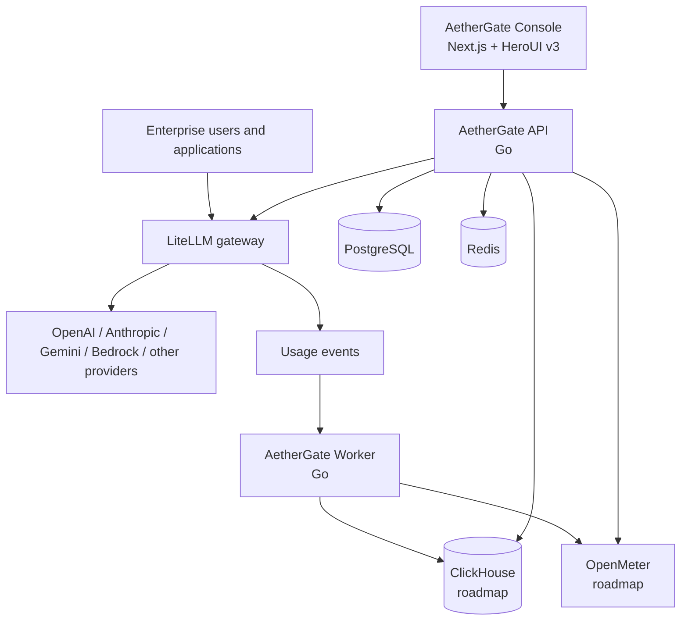

# AetherGate

**Open-source enterprise AI gateway and usage intelligence platform.**

[简体中文](./README.zh-CN.md) · [Architecture](./docs/architecture/system-overview.md) · [Deployment](./docs/deployment/server-foundation.md) · [Roadmap](./docs/roadmap/README.md)

> Project status: foundation and early development. The public APIs, schemas, and deployment topology may change before the first stable release.

AetherGate is a control plane for organizations that need to route, meter, govern, and analyze LLM API traffic across providers, teams, projects, applications, and engineers. It is initiated and maintained by TopoAI as an independent open-source project.

## Why AetherGate

Most API relay systems center on individual accounts, balances, and basic usage totals. AetherGate is designed around enterprise operations:

- organizations, workspaces, departments, projects, applications, and members;
- API keys, model access policies, RPM/TPM limits, concurrency, and budgets;
- usage, token, cost, latency, error, and engineering-activity analytics;
- auditable administration and integration with enterprise billing workflows;
- self-hosted deployment with a clear path from a single server to distributed services.

## Architecture



LiteLLM is the model data plane: routing, provider credentials, virtual keys, limits, and failover. AetherGate is the enterprise control plane: organization data, governance, reporting, and product workflows. See the [system overview](./docs/architecture/system-overview.md) for service and data ownership.

## Planned capabilities

### Foundation

- Organization, workspace, department, project, application, and member management
- LiteLLM integration for models, virtual keys, budgets, and access policy
- PostgreSQL-backed control-plane data
- API key lifecycle and model permission management
- Docker Compose deployment for LiteLLM, PostgreSQL, PgBouncer, and Redis

### Usage intelligence

- Request, token, cost, latency, and error reporting
- Project, application, department, and engineer activity views
- ClickHouse-backed high-volume analytics
- Alerts, anomaly detection, and exportable reports

### Metering and billing

- OpenMeter integration
- Credits, quotas, contract pricing, and budget enforcement
- Enterprise statements, reconciliation, and billing exports

## Repository layout

```text
aethergate/
├── apps/
│   ├── console/                 # Next.js, TypeScript, HeroUI v3
│   ├── api/                     # Go control-plane API
│   └── worker/                  # Go event and background workers
├── packages/
│   ├── ui/                      # Shared UI and DataGrid boundary
│   ├── contracts/               # OpenAPI and cross-service schemas
│   ├── database/                # Database conventions and migrations
│   ├── sdk/                     # Generated or maintained client SDKs
│   └── config/                  # Shared repository configuration
├── integrations/
│   ├── litellm/
│   ├── openmeter/
│   └── clickhouse/
├── deploy/
│   ├── compose/core/            # Existing aethergate-litellm-stack belongs here
│   ├── compose/analytics/       # ClickHouse/OpenMeter deployment, later phase
│   ├── postgres/init/
│   ├── pgbouncer/
│   ├── litellm/
│   └── monitoring/
├── docs/
│   ├── product/
│   ├── architecture/
│   ├── development/
│   ├── deployment/
│   └── roadmap/
├── examples/
├── scripts/
└── tests/
```

Each major directory contains a local README describing its responsibility and ownership boundaries.

## Technology decisions

| Area | Initial choice |
|---|---|
| Console | Next.js App Router, React 19+, TypeScript, Tailwind CSS v4, HeroUI v3 |
| Complex tables | HeroUI Table first; vendor-neutral `DataGrid` adapter for advanced enterprise grids |
| API | Go |
| Background jobs | Go |
| Control-plane data | PostgreSQL through PgBouncer for normal runtime traffic |
| Gateway | LiteLLM Proxy |
| Cache/coordination | Redis |
| Analytics | ClickHouse, introduced in the usage-intelligence phase |
| Metering/billing | OpenMeter, introduced in the billing phase |

## Getting started

The application source is being scaffolded. The first usable artifact is the infrastructure stack already prepared for LiteLLM development.

1. Put the version-controlled files from `aethergate-litellm-stack` in [`deploy/compose/core`](./deploy/compose/core/README.md).
2. Do **not** commit `.env`, generated backend environment files, secrets, backups, logs, or database volumes.
3. Follow [Importing the existing stack](./docs/deployment/stack-import.md).
4. Follow [Server foundation deployment](./docs/deployment/server-foundation.md) to configure, start, verify, back up, and update the services.

The deployment copy on a server should remain under `/opt/aethergate` or `/opt/aethergate-litellm-stack`; the repository copy is the reviewed source of truth and must not contain production secrets.

## Documentation

- [Product overview](./docs/product/overview.md)
- [System architecture](./docs/architecture/system-overview.md)
- [Development guide](./docs/development/getting-started.md)
- [Import the existing deployment stack](./docs/deployment/stack-import.md)
- [Server foundation deployment](./docs/deployment/server-foundation.md)
- [Roadmap](./docs/roadmap/README.md)

## Open-source and enterprise editions

The open-source project is intended to provide a useful gateway control plane, organizations and workspaces, key management, model policy, basic usage intelligence, and self-hosted deployment. TopoAI may provide commercial services such as enterprise SSO, advanced audit and governance, invoicing, contract pricing, multi-region high availability, private deployment, support, and custom applications.

The open-source edition must remain independently deployable and useful; commercial functionality should integrate through documented boundaries rather than hidden dependencies.

## Contributing and security

Read [CONTRIBUTING.md](./CONTRIBUTING.md) before proposing a change. Security issues should follow [SECURITY.md](./SECURITY.md) and must not be disclosed in a public issue before maintainers have had an opportunity to respond.

## License

Licensed under the [Apache License 2.0](./LICENSE).
