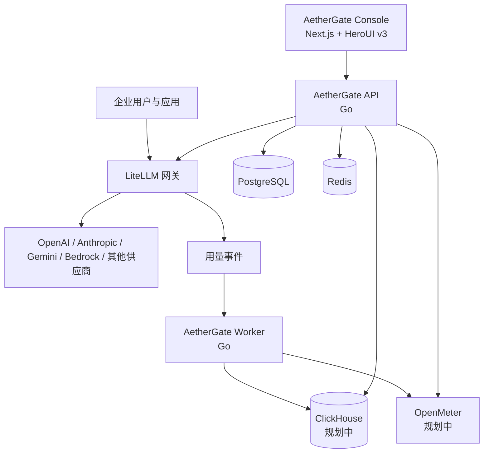

# AetherGate

**开源企业级 AI 网关与使用智能平台。**

[English](./README.md) · [系统架构](./docs/architecture/system-overview.md) · [部署文档](./docs/deployment/server-foundation.md) · [开发路线](./docs/roadmap/README.md)

> 项目状态：基础建设与早期开发阶段。第一个稳定版本发布前，公开 API、数据结构和部署拓扑可能发生变化。

AetherGate 面向需要统一路由、计量、治理和分析大模型 API 流量的企业。它围绕企业、工作空间、部门、项目、应用与工程师组织数据，由 TopoAI 发起并维护，但以独立开源项目的方式建设。

## 为什么需要 AetherGate

多数 API 中转系统围绕个人账户、余额和基础用量统计设计。AetherGate 面向企业运营与治理：

- 企业、工作空间、部门、项目、应用和成员；
- API Key、模型权限、RPM/TPM、并发与预算；
- 用量、Token、成本、延迟、错误率和工程师活跃度分析；
- 可审计的管理操作以及企业计费流程集成；
- 从单机 Docker Compose 平滑演进到分布式服务的自托管部署。

## 系统架构



LiteLLM 是模型数据面，负责模型路由、供应商凭据、Virtual Key、限流和故障切换。AetherGate 是企业控制面，负责组织数据、治理、报表和产品工作流。详细职责见[系统架构](./docs/architecture/system-overview.md)。

## 规划能力

### 第一阶段：基础平台

- 企业、工作空间、部门、项目、应用与成员管理
- 对接 LiteLLM 的模型、Virtual Key、预算与访问策略
- PostgreSQL 控制面数据
- API Key 生命周期与模型权限管理
- LiteLLM、PostgreSQL、PgBouncer、Redis 的 Docker Compose 部署

### 第二阶段：使用智能

- 请求量、Token、成本、延迟和错误率报表
- 项目、应用、部门与工程师活跃度分析
- 基于 ClickHouse 的高吞吐分析
- 告警、异常检测与报表导出

### 第三阶段：计量和账单

- OpenMeter 集成
- 额度、配额、合同价格与预算执行
- 企业账单、对账和计费数据导出

## 仓库目录

```text
aethergate/
├── apps/
│   ├── console/                 # Next.js、TypeScript、HeroUI v3
│   ├── api/                     # Go 控制面 API
│   └── worker/                  # Go 用量事件与后台任务
├── packages/
│   ├── ui/                      # 公共 UI 与 DataGrid 适配边界
│   ├── contracts/               # OpenAPI 与跨服务 Schema
│   ├── database/                # 数据库规范与迁移
│   ├── sdk/                     # 客户端 SDK
│   └── config/                  # 仓库公共配置
├── integrations/
│   ├── litellm/
│   ├── openmeter/
│   └── clickhouse/
├── deploy/
│   ├── compose/core/            # 现有 aethergate-litellm-stack 放在这里
│   ├── compose/analytics/       # 后续 ClickHouse/OpenMeter 部署
│   ├── postgres/init/
│   ├── pgbouncer/
│   ├── litellm/
│   └── monitoring/
├── docs/
│   ├── product/
│   ├── architecture/
│   ├── development/
│   ├── deployment/
│   └── roadmap/
├── examples/
├── scripts/
└── tests/
```

## 技术方案

| 领域 | 第一阶段选择 |
|---|---|
| Console | Next.js App Router、React 19+、TypeScript、Tailwind CSS v4、HeroUI v3 |
| 复杂表格 | 优先 HeroUI Table；高级企业表格通过统一 `DataGrid` 适配层接入 |
| API | Go |
| 后台任务 | Go |
| 控制面数据库 | PostgreSQL，普通运行流量通过 PgBouncer |
| 模型网关 | LiteLLM Proxy |
| 缓存与协调 | Redis |
| 分析 | 第二阶段引入 ClickHouse |
| 计量和账单 | 第三阶段引入 OpenMeter |

## 开始使用

应用源码正在搭建。当前第一份可运行成果是已经准备好的 LiteLLM 基础设施 Stack。

1. 将 `aethergate-litellm-stack` 中需要版本控制的文件放到 [`deploy/compose/core`](./deploy/compose/core/README.md)。
2. 不要提交 `.env`、自动生成的后端环境文件、密钥、备份、日志和数据库卷。
3. 按照[迁入现有 Stack](./docs/deployment/stack-import.md)整理文件。
4. 按照[服务器基础部署](./docs/deployment/server-foundation.md)完成配置、启动、验证、备份和更新。

服务器运行副本建议保留在 `/opt/aethergate` 或 `/opt/aethergate-litellm-stack`；仓库中的部署目录是经过评审的配置源，不能包含生产密钥。

## 文档

- [产品说明](./docs/product/overview.md)
- [系统架构](./docs/architecture/system-overview.md)
- [开发指南](./docs/development/getting-started.md)
- [迁入现有部署 Stack](./docs/deployment/stack-import.md)
- [服务器基础部署](./docs/deployment/server-foundation.md)
- [路线图](./docs/roadmap/README.md)

## 开源版与企业版

开源项目计划提供可独立使用的网关控制面、企业与工作空间、Key 管理、模型策略、基础使用分析和自托管部署。TopoAI 可在此基础上提供企业 SSO、高级审计与治理、发票和合同价格、多地域高可用、私有化部署、技术支持与定制应用。

开源版应保持可独立部署和真实可用；商业功能通过明确的扩展边界集成，不依赖隐藏服务。

## 贡献与安全

提交修改前请阅读 [CONTRIBUTING.md](./CONTRIBUTING.md)。安全问题请遵循 [SECURITY.md](./SECURITY.md)，在维护者有机会处理前不要通过公开 Issue 披露漏洞。

## 许可证

本项目使用 [Apache License 2.0](./LICENSE)。

