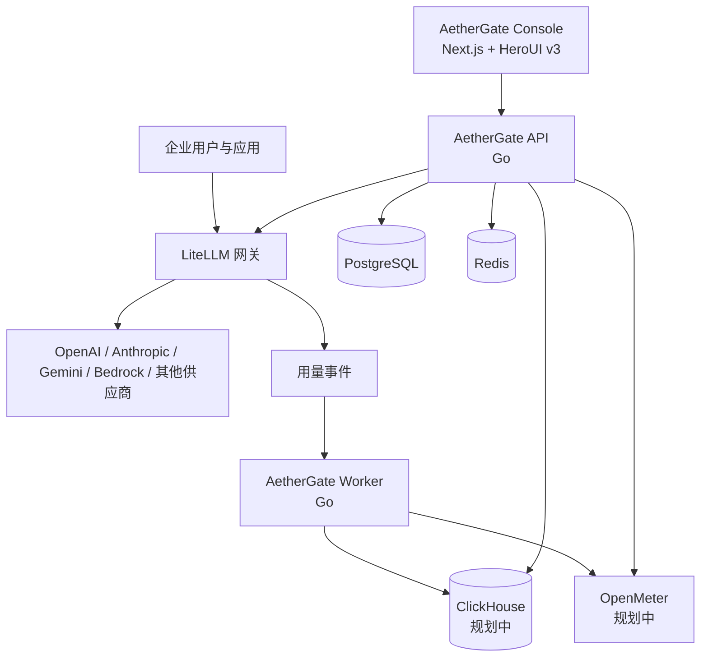

# AetherGate

**开源企业级 AI 网关与使用智能平台。**

[English](./README.md) · [系统架构](./docs/architecture/system-overview.md) · [部署文档](./docs/deployment/server-foundation.md) · [Helicone 功能迁移矩阵](./docs/product/helicone-feature-parity.md) · [开发路线](./docs/roadmap/README.md)

> 项目状态：基础阶段正在持续开发。Console 和第一版 Go API 已可本地运行，但当前可观测数据明确属于开发种子数据。第一个稳定版本发布前，公开 API、数据结构和部署拓扑仍可能调整。

AetherGate 面向需要统一路由、计量、治理和分析大模型 API 流量的企业。它围绕企业、工作空间、项目、应用、成员和工程师组织数据，由 TopoAI 发起并维护，采用 Apache-2.0 许可证独立建设。

## 当前已经可用的内容

- 基于 Next.js 16、React 19、Tailwind CSS v4 和 HeroUI v3 的深色 Console。
- 已可交互的 Dashboard、Requests、Organizations、API Keys、Workspaces、Projects、Members、Models、Providers 与 Provider Health、Routing、Rate limits、Budgets、Alerts、Webhooks、Scheduled Reports、Notifications、Enterprise Vault、Audit Trail 和 Developer Integration Diagnostics 产品页面。
- Helicone 对标范围中的全部产品路由已经登记；未完成模块会显示真实迁移状态，不会伪装成已交付功能。
- Go 控制面 API 已提供健康检查、可观测性、企业、API Key、工作空间、项目、成员、模型、提供商健康、路由、限流、预算、告警、Webhooks、定时报表、通知、信封加密 Vault、不可变审计事件、哈希链校验、保留策略、审计导出和凭据安全的 LiteLLM 诊断端点。
- 已实现内存开发存储，并提供可选的 pgx/PostgreSQL 存储层和显式、可逆的迁移脚本。
- Provider Health 已包含主动探测队列、被动遥测、连续三次失败防抖、维护期抑制、状态变更证据和明确的路由资格判定。
- Go 端点测试、TypeScript 检查、ESLint 和 Next.js 生产构建均可执行。
- `deploy/compose/core` 下已有 LiteLLM、PostgreSQL、PgBouncer 与 Redis 的开发 Stack。
- [Helicone → AetherGate 功能迁移矩阵](./docs/product/helicone-feature-parity.md)已经按功能列出验收边界。

已实现的 Console 页面会调用 Go API；当 API 不可用时，会明确显示为本地预览数据。当前可观测性仍是开发种子数据，并且本工作站尚未完成真实 PostgreSQL 持久化验证。LiteLLM 配置与 liveness/readiness 诊断已经实现，Master Key 不会返回浏览器，也不会读取 LiteLLM 内部表；但尚未对真实 Stack 完成流式请求、Virtual Key 强制、路由和用量归属验证。主动 Provider 检查、报表生成、外部通知投递、审计导出文件生成和特权保留清理仍需要独立 Worker。Vault 元数据、AES-256-GCM 信封加密、版本轮换、禁用、仅内部解析和访问证据已经实现，但外部 KMS/密钥环重包与真实 Provider/Worker 解析尚未完成。审计追加、检索、哈希链校验以及保留/导出控制面已经实现，但所有管理领域的自动审计事件写入尚未完成。租户认证、HTTP 权限强制、真实 Worker 执行和真实数据库集成仍属于基础阶段工作，不会提前标记为完成。

## 为什么需要 AetherGate

多数 API 中转系统围绕个人账户、余额和基础用量统计设计。AetherGate 面向企业运营与治理：

- 企业、工作空间、部门、项目、应用和成员；
- API Key、模型权限、RPM/TPM、并发、预算和路由策略；
- 请求、Token、成本、延迟、可靠性、质量和工程采用情况分析；
- Prompt、数据集、Playground、评估器与实验工作流；
- 可审计的管理操作以及企业身份、计量与计费流程集成；
- 从单机 Docker Compose 演进到分布式服务的自托管部署。

## 系统架构



LiteLLM 是模型数据面，负责模型路由、供应商连接、Virtual Key、限流和故障切换。AetherGate 是企业控制面，负责租户、权限、治理、可观测性、报表和产品工作流。详细职责见[系统架构](./docs/architecture/system-overview.md)。

## 本地启动

前置条件：

- Node.js 20+ 与 npm 11+
- Go 1.26.4+
- 如需启动基础设施，准备 Docker 与 Compose v2

安装并启动 Console：

```powershell
npm install
npm run dev
```

浏览器访问 `http://localhost:3000`。

在另一个终端启动 Go API：

```powershell
go run ./apps/api/cmd/server
```

API 默认监听 `http://localhost:8080`，当前端点包括：

- `GET /healthz`
- `GET /readyz`
- `GET /api/v1/overview`
- `GET /api/v1/requests`
- `GET /api/v1/requests/{requestID}`

执行当前验证：

```powershell
npm run typecheck
npm run lint
npm run build
go test ./apps/api/...
go vet ./apps/api/...
```

## 基础部署 Stack

服务器上已有的 `aethergate-litellm-stack`，其需要版本控制的源文件应放在 [`deploy/compose/core`](./deploy/compose/core/README.md)。服务器运行副本继续保留在 `/opt/aethergate` 或 `/opt/aethergate-litellm-stack`，不要把运行时密钥或数据库数据复制进 Git。

1. 仅将 Stack 的源文件复制到 `deploy/compose/core`。
2. 不要提交 `.env`、自动生成的密钥、备份、日志和数据库卷。
3. 按照[迁入现有 Stack](./docs/deployment/stack-import.md)整理文件。
4. 按照[服务器基础部署](./docs/deployment/server-foundation.md)完成配置、启动、验证、备份、恢复与更新。

## 仓库目录

```text
aethergate/
|-- apps/
|   |-- console/                 # Next.js、TypeScript、HeroUI v3
|   |-- api/                     # Go 控制面 API
|   `-- worker/                  # Go 用量事件与后台任务
|-- packages/
|   |-- ui/                      # 公共 UI 与 DataGrid 适配边界
|   |-- contracts/               # OpenAPI 与跨服务 Schema
|   |-- database/                # 数据库规范与迁移
|   |-- sdk/                     # 客户端 SDK
|   `-- config/                  # 仓库公共配置
|-- integrations/
|   |-- litellm/
|   |-- openmeter/
|   `-- clickhouse/
|-- deploy/
|   |-- compose/core/            # LiteLLM 开发 Stack
|   |-- compose/analytics/       # 后续 ClickHouse/OpenMeter 部署
|   |-- postgres/init/
|   |-- pgbouncer/
|   |-- litellm/
|   `-- monitoring/
|-- docs/
|   |-- product/
|   |-- architecture/
|   |-- development/
|   |-- deployment/
|   `-- roadmap/
|-- examples/
|-- scripts/
`-- tests/
```

## 技术方案

| 领域 | 当前选择 |
| --- | --- |
| Console | Next.js App Router、React 19、TypeScript、Tailwind CSS v4、HeroUI v3 |
| 复杂表格 | 优先 HeroUI Table；高级企业表格通过统一 `DataGrid` 适配层接入 |
| API | Go |
| 后台任务 | Go |
| 控制面数据库 | PostgreSQL，普通运行流量通过 PgBouncer |
| 模型网关 | LiteLLM Proxy |
| 缓存与协调 | Redis |
| 分析 | 用量规模需要时引入 ClickHouse |
| 计量与计费 | 进入账单域时引入 OpenMeter |

## Helicone 功能迁移

Helicone 是 Apache-2.0 的产品和交互参考，不是 AetherGate 的运行时依赖。当前审计的上游提交，以及网关、可观测性、Prompt/评估、运维、身份、账单和开发者能力，统一记录在[功能迁移矩阵](./docs/product/helicone-feature-parity.md)中。

一个功能只有在领域模型、Go API、权限、持久化、完整 UI 状态、自动化测试和部署证据全部通过后，才能标记为验证完成。仅有页面路由或视觉 Mock 不算完成功能迁移。

## 文档

- [产品说明](./docs/product/overview.md)
- [Helicone 功能迁移矩阵](./docs/product/helicone-feature-parity.md)
- [系统架构](./docs/architecture/system-overview.md)
- [开发指南](./docs/development/getting-started.md)
- [迁入现有部署 Stack](./docs/deployment/stack-import.md)
- [服务器基础部署](./docs/deployment/server-foundation.md)
- [路线图](./docs/roadmap/README.md)

## 开源版与企业版

开源项目应保持可独立部署和真实可用，包括网关控制面、企业与工作空间、Key 管理、模型策略、核心可观测性、Prompt/评估工作流和自托管部署。TopoAI 可以在此基础上提供企业 SSO、高级审计与治理、合同价格和发票、多地域高可用、私有化部署、技术支持与定制应用。

商业功能必须通过公开的扩展边界集成，不能依赖隐藏服务。

## 贡献与安全

提交修改前请阅读 [CONTRIBUTING.md](./CONTRIBUTING.md)。安全问题请遵循 [SECURITY.md](./SECURITY.md)，在维护者有机会处理前不要通过公开 Issue 披露漏洞。

## 许可证

本项目使用 [Apache License 2.0](./LICENSE)。
