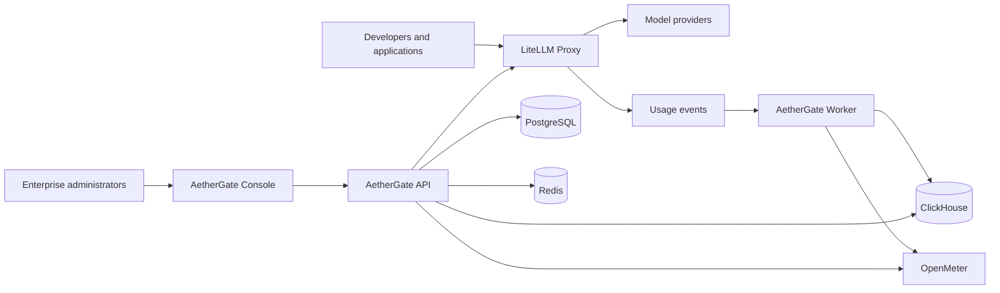

# System Architecture

## Context



## Service responsibilities

| Component | Owns | Must not own |
|---|---|---|
| Console | Enterprise management experience, reporting views, Workbench UI | Credentials, authorization truth, direct database access |
| AetherGate API | Enterprise resources, authorization, policies, mappings, audit, reporting APIs | Model request proxying, LiteLLM internal tables |
| AetherGate Worker | Asynchronous ingestion, normalization, exports, notifications | Interactive user requests or primary authorization |
| LiteLLM | Model routing, provider credentials, virtual keys, gateway limits, failover | AetherGate organization model and enterprise contracts |
| PostgreSQL | Transactional control-plane configuration | High-volume analytical scans after ClickHouse is introduced |
| PgBouncer | PostgreSQL connection pooling | Schema migrations or ownership of application state |
| Redis | Bounded cache, coordination, rate-related transient state | Durable source of truth |
| ClickHouse | Usage facts and analytical aggregates | Enterprise configuration |
| OpenMeter | Metering, credit, entitlement, and billing state | General organization management |

## Database isolation

The initial single-server deployment shares one PostgreSQL instance but isolates applications:

```text
PostgreSQL instance
├── database: litellm
│   └── owner: litellm_user
└── database: aethergate
    └── owner: aethergate_user
```

AetherGate accesses only its own database. Integration with LiteLLM occurs through supported administrative and gateway APIs.

## Connection policy

```text
AetherGate runtime  -> PgBouncer transaction pool -> aethergate database
AetherGate migrate  ------------------------------> aethergate database
LiteLLM startup     ------------------------------> litellm database
```

LiteLLM may use a tested session pool later. Do not route schema migrations through a transaction pool.

## Trust boundaries

- Browser to AetherGate API: authenticated HTTPS; authorization enforced by the API.
- Applications to LiteLLM: scoped virtual keys; no master credential distribution.
- AetherGate API to LiteLLM Admin API: server-side privileged credential.
- Services to databases: private network, distinct least-privilege accounts.
- Usage pipeline: organization and request identifiers with idempotent event processing.

## Evolution

Phase one runs the API, Console, Worker, LiteLLM, PostgreSQL, PgBouncer, and Redis on a documented single-server foundation. Phase two introduces ClickHouse only after event contracts and retention are stable. Phase three introduces OpenMeter after pricing and entitlement semantics are defined.

